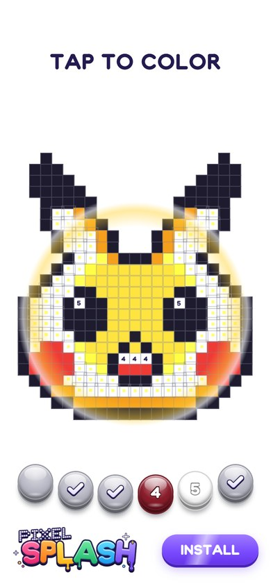

# Pixel Splash — tap-to-color playable

**▶ Play it: https://andersonigarashi.github.io/coloring_using_number/**



Playable ad: tap a numbered cell (or its palette button) and a drop of paint jumps from the button onto the picture,
splashes, and a radial wave paints every cell of that color. Finish all six colors to reveal the pixel-art face, trigger
the confetti and reach the end card.

Everything is plain DOM + CSS driven by the Web Animations API (no canvas engine), Howler plays audio and
`@smoud/playable-sdk` handles the ad-network lifecycle.

## Run

```bash
npm install
npm run dev      # http://localhost:3004
npm run build    # single inlined HTML in dist/
npm run typecheck
```

Every push to `main` runs `.github/workflows/pages.yml`, which builds the playable and publishes it to GitHub Pages
together with the showcase page in `pages/index.html` (phone frame on desktop, full screen on phones). The raw playable
is served as `play.html`.

## Code

| Path | What |
|---|---|
| `src/Game.ts` | Board and palette, group painting (paint drop → splash → radial wave), optional drag brush, win cinematic (spinning confetti), end card, tutorial hand, store redirect |
| `src/config.ts` | Tunables: pixel art and palette, paint mode, cell material (`flat` / `bevel` / `sparkle`), palette layout, timings, haptics, store rules |
| `src/cellTextures.ts` | Procedural fur and gloss textures (canvas) for the `bevel` material |
| `src/index.css` | Portrait / landscape layout, glossy 3D buttons, every keyframe animation, loading splash |
| `src/index.ts` | Boot: SDK lifecycle and splash |
| `pages/index.html` | GitHub Pages showcase |

## Assets

Apart from the tutorial hand (`assets/images/handTutorial.png`), every asset is generated from code by the scripts
in `tools/` (Python 3 + numpy + Pillow); the confetti is drawn with CSS at runtime:

1. `font.py` + `skel.py` — the **Pixel Splash** typeface: each glyph is a stroke skeleton, outlined through a signed
   distance field and marching squares, and written straight into a TrueType file
2. `logo.py`, `icon.py`, `check.py`, `sparkle.py` — images rendered by a small SDF painter (`sdfdraw.py`)
3. `pixel_art.py` — the board picture, printed as the `pixels` array for `src/config.ts`
4. `sfx.py` — sound effects synthesized with numpy (FM bells, marimba, Karplus–Strong plucks), encoded to MP3 by
   `encode_mp3.py` through Blender's bundled FFmpeg

Regenerate them into `assets/` (PNGs are compressed when pngquant is on `PATH` or passed with `--pngquant`):

```bash
python tools/build_assets.py --blender "C:\Program Files\Blender Foundation\Blender 5.2\blender.exe"
```

## How It Was Built (AI Workflow)

Claude Code wrote the game code and the Python generators in `tools/`, so no asset was drawn or recorded by hand except
the tutorial hand. My part was direction and review: I played each build on a phone and decided what had to change.

| Stage | Tool | What it did |
| --- | --- | --- |
| Typeface | Claude Code → `skel.py`, `font.py` | Stroke skeletons outlined through an SDF and marching squares, written to TrueType |
| Logo and icons | Claude Code → `sdfdraw.py` | A small SDF painter for the logo, icon, check mark and sparkle |
| Pixel art | Claude Code → `pixel_art.py` | The board picture, cell by cell |
| Sound | Claude Code → `sfx.py` (numpy) | FM bells, marimba and Karplus–Strong plucks, encoded to MP3 |
| Game | Claude Code | TypeScript, DOM and CSS driven by the Web Animations API |

### What I changed after playing it

- **Tutorial hand.** It pointed at the wrong targets and looked rough. It now walks the palette in order, from 1 to the
  last color left, and uses a hand illustration I supplied.
- **One input.** Tapping the numbers on the picture also painted. Painting now starts only from the palette buttons.
- **Keep the grid.** Cell borders stay visible after a color fills, so the picture still reads as pixel art.
- **Confetti.** Each piece rotates over its lifetime, in both directions and at different speeds.
- **Store redirect.** Finishing the picture, or tapping a "next level" button, opens the store.
- **Cut what nobody sees.** I asked for a pixel-art wink at the end, then removed it after seeing it in the build: at that
  size nobody notices it, so it only cost processing.
- **Resize.** The game stuttered while I resized it with DevTools open. Resizes are now coalesced into one layout per frame.
- **Feedback.** A used color button fades to grey because its paint is gone, and the logo has a subtle idle pulse.

Pikachu is © Nintendo / Creatures / GAME FREAK. The pixel-art face is fan art for a non-commercial portfolio piece.
